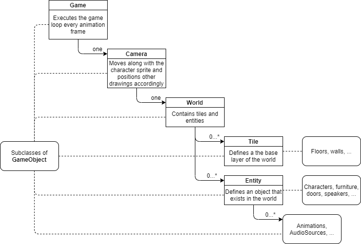
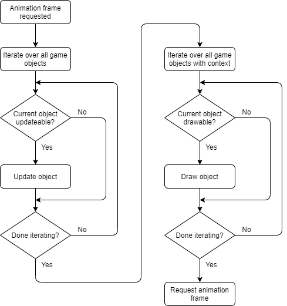
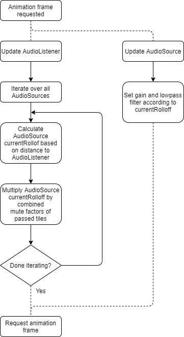
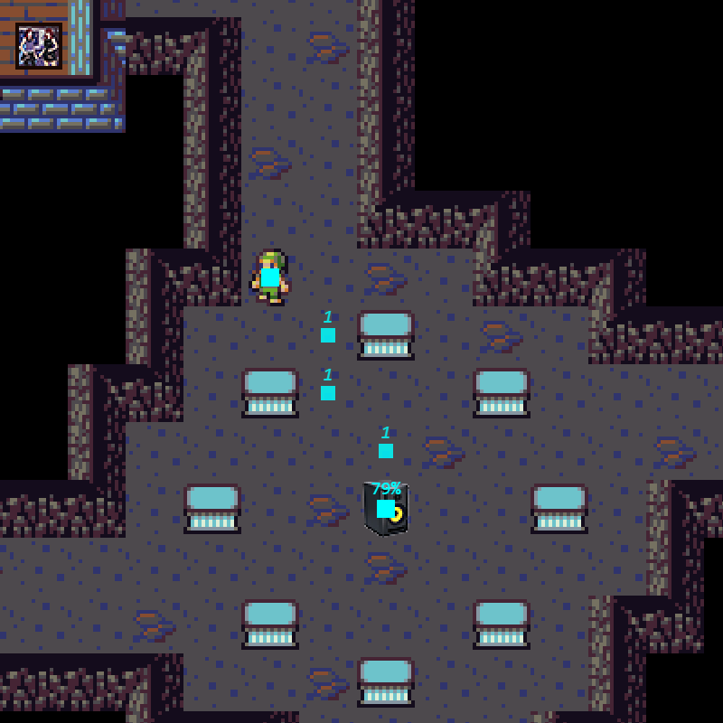
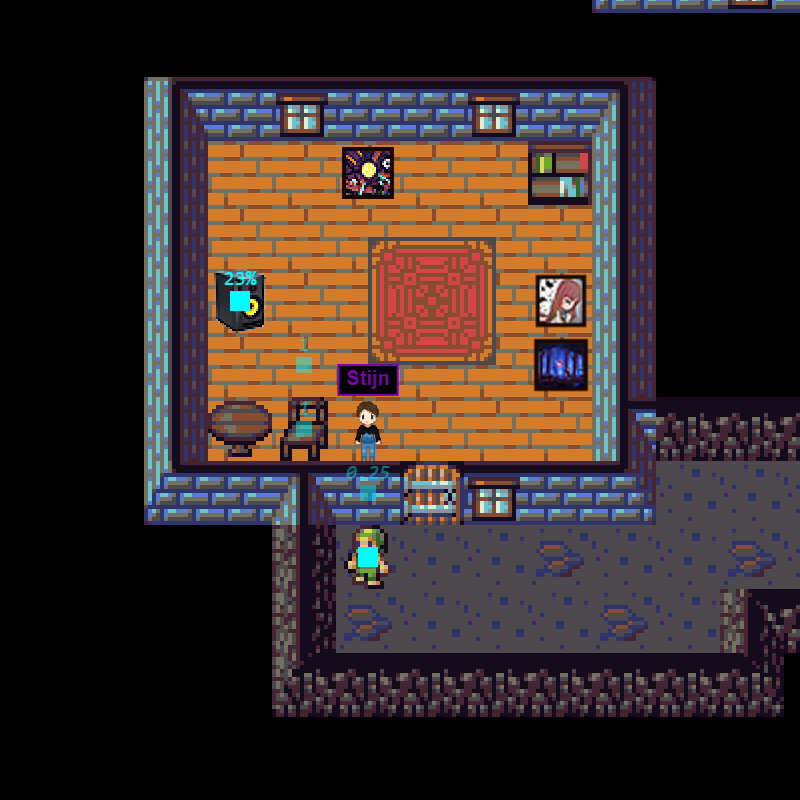
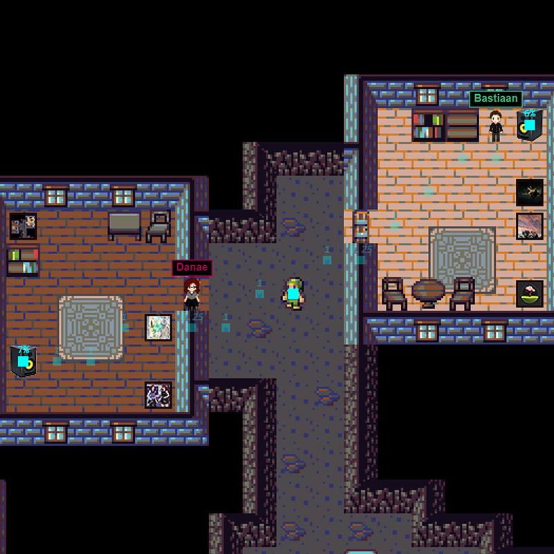
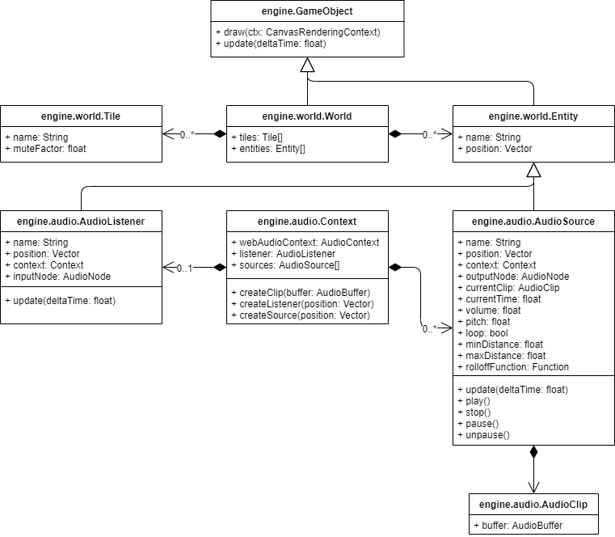

# Ocarime: The Game

*Ocarime: The Game* is an interactive portfolio presentation for [Ocarime](https://ocarime.com), a team of composers, sound designers and audio programmers. The game is remiscent of a top down role playing game, such as the older *Final Fantasy* series, where the player meets the members of the team as NPCs. The player can listen to their music and view their portfolio by interacting with the environment and objects. The game itself acts as a portfolio item for the team as well, and shows what its members are capable of creating.

## Game engine

The game engine is written from scratch in HTML5 and JavaScript, based on priciples also used by the [Unity](https://unity.com/) and [Godot](https://godotengine.org/) game engines. The engine uses the [Canvas API](https://developer.mozilla.org/en-US/docs/Web/API/Canvas_API) for visual content and the [Web Audio API](https://developer.mozilla.org/en-US/docs/Web/API/Web_Audio_API) for audio content. Moreover the [Fetch API](https://developer.mozilla.org/en-US/docs/Web/API/Fetch_API) is used for asset loading.

While initially written for the purpose of this interactive website, the engine is written in a modular way, so that it can easily be decoupled from the actual game. In that way it can be re-used in other top down tile-based games.

## Engine system design

The following chapter gives a quick overview of the game engine to understand how the audio system is tied into that.

### Game object hierachy

At its core the game engine consists of a tree structure of GameObjects. A **GameObject** acts as the base class for everything that is present in the game, and provides an implementation for this hierarchy. Moreover the GameObject class has functionality for drawing and updating itself in the game loop.

The game object hierarchy used in *Ocarime: The Game* consists of the following components:

* The top of the hierarchy is always the **Game** class, which contains the game loop (that is run every animation frame by invoking `requestAnimationFrame`) as well as functionality for loading assets and handling events.
* Directly underneath the Game class is the **Camera** class. This class transforms the drawing region based on the position of the player character and draws all child GameObjects based on this transformation.
* Every game contains a **World** object that contains the actual game world. The world is made up of **Tiles**, which form a tile map with for example floors and walls, and **Entities**, which are objects that are present in the world, such as characters, furniture, doors and speakers. Since every Tile and Entity is a GameObject, they can contain extra functionality, such as animations or audio sources.

The following image gives a visual overview of the game object hierarchy as it is used in *Ocarime: The Game*:



### Game loop

The game loop is initiated every animation frame and does the following three things:

* Recursively update all GameObjects in the hierarchy using their `update` functions. The update function takes into account the time it took from the last frame until now, so that physics can be easily simulated.
* Recursively draw all GameObjects in the hierarchy using their `draw` functions. Extra functionality in this iteration is that parent GameObjects can contain `beginContext` and `endContext` functions, where the drawing context can be changed for that object and **all** its children. This functionality is for example used to draw all child GameObjects of a camera at the correct positions.
* Request the next animation frame, thus restarting the game loop.

The following image depicts a flow chart for an animation frame:



## Audio system design

The goal of the audio system in the game is to implement a non-linear music system containing six compositions that represent the six team members of Ocarime. More specific, the audio system should minimally be capable of doing the following:

* Creating components that represent audio sources and listeners based on the Web Audio API, that can be placed in the game world.
* Playing audio sources with realistic filters based on the position of the listener. Also obstacles like walls and doors, which disturb the way of the sound, will be taken into account in the system.
* Streamlining the six compositions by playing them at the same time and looping them, so the soundtracks fade over in each other nicely.

The audio system is created as part of the game engine to easily integrate with the world. The implementation of the audio system can be found in the [engine/audio](https://github.com/ocarime/thegame/tree/master/src/engine/audio) module in the source code.

### Audio sources and listeners

The main components of the audio system are audio sources, which represent sources in the world, and an audio listener, that can "hear" the sources. Like other entities, audio sources and listeners are placed at a position in the game world. How a listener percieves a source is determined by two factors:

* The distance between the source and the listener: if a source is further away from the listener, is is less loud and can be muffled.
* The materials through which the sound must travel from a source to reach the listener, which is reflected by the tiles on the world map.

Every animation frame all audio sources calculate their rolloff value according to those factors and update their audio parameters accordingly, as depicted in the following flow chart:



#### Example

The logic of audio sources and listeners is illustrated in the following example:



Sound travels in a straight line from the source (speaker) to the listener (player). Because of the distance between them, the sound is only heard for 79%, which is reflected in the volume and low pass filtering of the source. If a source is too far away from the listener, it cannot be heard at all.



Every tile has a mute factor that muffles the sound of the source. Floors for example do not limit the flow of sound and therefore have a mute factor of 1.0. Walls mute sound and have a mute factor of 0.25.

In this case the sound needs to travel through a wall, that has a mute factor of 0.25. This means that the source is only hearable for 1/4th of its expected volume based on only the distance calculation, which results in a volume of 23%.



In this example the listener is in range of two sources, which both need to travel through a wall with mute factor 0.25. Because of the greater distance compared to the previous example, the sources are only for respectively 7% and 6% hearable.

### Components of the audio system

The following image depicts the class diagram, which is implemented quite unchanged from the original design, apart from some Web Audio API specific code:



#### Audio source component

The [AudioSource](https://github.com/ocarime/thegame/blob/master/src/engine/audio/AudioSource.js) class represents a source that exists in the world at a given position. An AudioSource contains the following variables and functions:

* A vector that represents the **position** of the audio source in the world.
* A **rolloff function**  that calculates the volume of the source based on the distance to the listener.
* Two floats to set the **minimal** and **maximal rolloff distance**, i.e. the range where the rolloff function determines the volume of the source. If the distance to the listener lis less than the minimal rolloff distance, the volume is at its highest; if the distance is greater than the maximal rolloff distance, the volume is 0.
* A reference to the **Web Audio context** and a reference to the **output AudioNode** to link to the AudioListener.
* A reference to an **audio clip** and functions to start, pause and stop playback of this clip.

In its update function, that is called every animation frame, the audio source updates its gain and lowpass filter frequency based on the current rolloff value that is calculated by the audio listener, but only if that value actually changed. This is implemented as follows:

```js
AudioSource.prototype.update = function(deltaTime)
{
  // Adjust the gain and filter of this audio source

  // this.gain refers to the 'gain' AudioParameter of a GainNode.
  this.gain.value = this.currentRolloff;

  // this.lowpassFrequency refers to the 'frequency' AudioParameter of a
  // BiquadFilterNode.
  this.lowpassFrequency.value = Math.pow(20000, this.currentRolloff) + 2000;
}
```

#### Audio listener component

The [AudioListener](https://github.com/ocarime/thegame/blob/master/src/engine/audio/AudioListener.js) class represents the listener that can "hear" the audio sources that are present in the world. It is attached to the character sprite that is controlled by the player. An AudioListener contains the following variables and functions:

* A vector that represents the **position** of the audio listener in the world.
* A reference to the **Web Audio context** and a reference to the **input AudioNode** to link to the AudioSources.

In its update function the audio listener updates the current rolloff values for each audio source based on the distance between the source and itself. This is implemented as follows:

```js
AudioListener.prototype.update = function(deltaTime)
{
  // Iterate over the audio sources
  for (let source of this.context.sources)
  {
    // Calculate the rolloff to the audio listener

    // Vector.distance returns the Euclidean distance between two points.
    source.currentDistance = Vector.distance(source.position, this.position);

    // source.rolloffFunction is a function that defines the degree of rolloff,
    // currently this is implemented as a linear interpolation between
    // source.minRolloff and source.maxRolloff.
    source.currentRolloff = source.rolloffFunction(source.currentDistance);

    // Calculate the mute factor based on the tiles that are passed

    // this.world.line returns an array of tiles that lay in a straight line
    // between the two provided positions.
    source.currentTilesPassed = this.world.line(source.position, this.position);
    for (let tile of source.currentTilesPassed)
      source.currentRolloff *= tile.muteFactor;
  }
}
```

#### Audio clip component

The [AudioClip](https://github.com/ocarime/thegame/blob/master/src/engine/audio/AudioClip.js) class is a static object (i.e. not apprearing in the world) that references an audio buffer. It is used in the asset loading system of the engine to easily create audio buffers that are in turn used in audio sources to actually play back the buffers.

#### Audio context component

The [Context](https://github.com/ocarime/thegame/blob/master/src/engine/audio/Context.js) class handles the underlying connection to the AudioContext of the Web Audio API. It also contains functions to easily create new clips, sources and listeners and connect the underlying AudioNodes.

### Music system

The music system is implemented in the [MusicSystem](https://github.com/ocarime/thegame/blob/master/src/game/audio/MusicSystem.js) component. This component registers the audio sources that are used for playing the six soundtracks (seven if the common soundtrack is counted as well), which defaults to an audio source linked to a speaker entity.

When the Web Audio context is started, the music system plays back the registered audio sources at the same time, so that transitions bettween them are synchronized.

### Future improvements

The current design and implementation of the audio system tries to give the player a fairly realistic experience in terms of audio. Therefore it is logical that the components are modeled after real world analogies. The system however can be further improved:

* To improve the muting of audio sources, the system can take into account what distance is travelled in each tile the sound passes and calculate the mute factor of that tile accordingly. For example if only a corner of a wall is touched by the sound, the mute factor is the same as when the whole wall is crossed from side to side. Implementation of this behaviour will probably be necessary to improve the credibility of the audio and to smoothen out changes in volume when the audio listener moves.
* The system does currently not take into account the reflections sound makes on surfaces of the tiles in the world. Calculating those can adjust the mute factor for more realism.
* A next step could be to implement the actual reflection paths of the sound with timing as well, but performance must be taken into account if the engine must make many calculations per frame.

An improvement for the music system is to add loop regions in the audio clips so that soundtracks with reverb tails can be displayed correctly. In the current implementation all audio files are pre-made with reverb tails, so in this specific implementation it wasn't necessary to implement this functionality.
